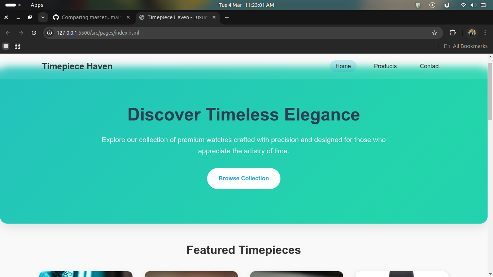
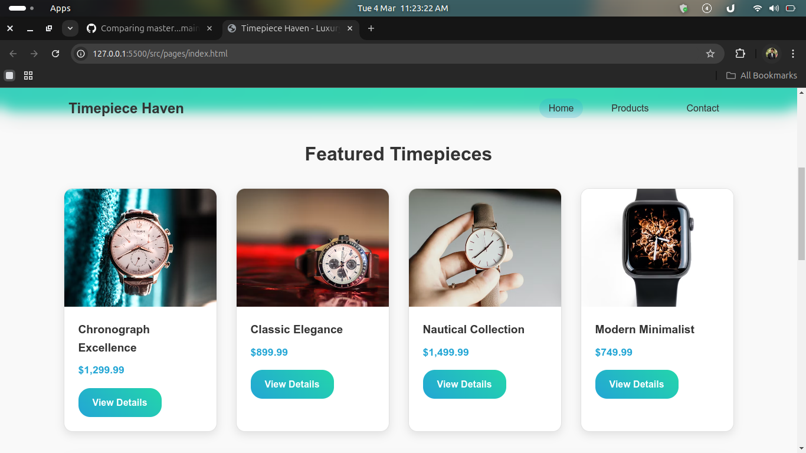
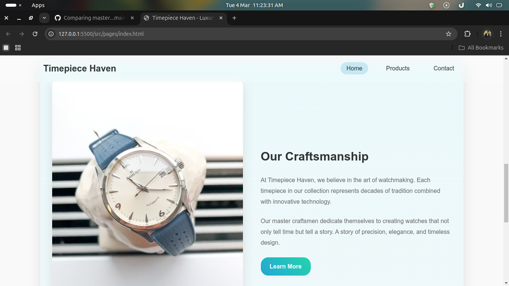
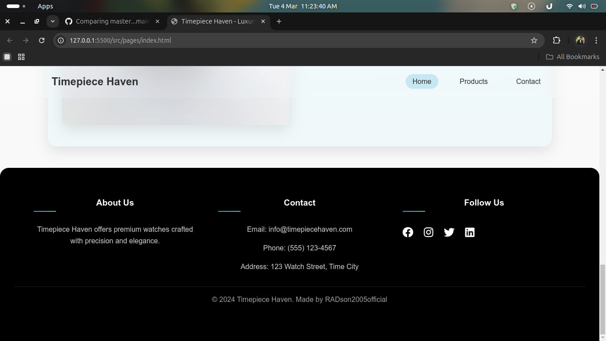

# Timepiece Haven Website
my first project wbsite:

A responsive e-commerce website for a luxury watch store called "Timepiece Haven". This project showcases a modern UI design with gradient animations and interactive elements.

## 📋 Project Overview

Timepiece Haven is a fictional luxury watch retailer website featuring product displays, contact forms, and responsive design. The project demonstrates modern web development practices including fluid layouts, CSS animations, and mobile-responsive design.

## 🚀 Technologies Used

- HTML5
- CSS3 (with animations, flexbox, and grid)
- JavaScript (ES6)
- Font Awesome icons

## ✨ Features

- Responsive design that works on mobile, tablet, and desktop
- Interactive product cards with hover effects
- Contact form with validation
- Animated gradient backgrounds
- Mobile navigation menu
- Product filtering functionality

## 📁 Project Structure
clock-shop-website/ ├── src/ │ ├── css/ │ │ ├── navigation.css │ │ └── styles.css │ ├── js/ │ │ └── main.js │ └── pages/ │ ├── index.html │ ├── products.html │ └── contact.html └── README.md

## 🖥️ Setup and Installation

1. Clone the repository:

git clone https://github.com/RADson2005official/Web_techlab.git

2. Navigate to the project directory:

cd Web_techlab/clock-shop-website

3. Open any HTML file in your browser to view the website.

## 📸 Screenshots

## 👤 Author

- [RADson2005official](https://github.com/RADson2005official)

## 📝 License

This project is open source and available under the [MIT License](LICENSE).